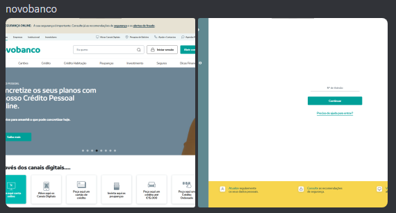

# 
EgoScam - Campanha de *Phishing*
**
Citeforma | CET 8493 | UFCD 9195 Enquadramento operacional de cibersegurança | Formador: João Almeida**
**
Hugo Miguel Félix Bugalho | João Rodrigo Mota da Costa | João Miguel Oliveira da Costa**

## Introdução
Neste documento, iremos documentar o planeamento do nosso esquema de *phishing*, denominado EgoScam.

Vamos apresentar a população-alvo, o conteúdo do email e como seria o site. Este trabalho foi realizado de acordo com as instruções dadas pelo formador João Almeida.

## Desenvolvimento do projeto
### População-alvo
O nosso grupo-alvo serão principalmente adultos, especialmente entre as idades de 35 e 65 anos, pois são o grupo mais provável de utilizar websites de *homebanking* num navegador. Decidimos focar-nos nesta faixa etária, uma vez que as pessoas mais jovens estão mais habituadas e têm um melhor conhecimento do conceito de uma aplicação em vez de um website. Além disso, em geral, pessoas acima dos 65 anos não têm conhecimento tecnológico suficiente para utilizar um computador, muito menos uma aplicação de *homebanking*. No entanto, caso tenham e utilizem esses serviços, também fazem parte deste público-alvo.

### O que oferecemos
Nos nossos emails, oferecemos "ajuda" para uma situação na qual as vítimas não têm controlo, ao "instalar" um sentimento de urgência para forçar a vítima a abrir a página e inserir as suas credenciais. Se isso levar a um erro ainda mais "assustador", pode criar uma situação ainda mais interessante, em que a vítima entra em contacto com o balcão, o que pode levar ao banco entrar em pânico ou então forçar o mesmo a ser os "mensageiros", e explicar ao cliente que foram vítimas de uma "burla" (ou seja, um ataque de *phishing*).

### Conteúdo do email
Seriam enviados emails de atualização de conta, a explicar que a conta tinha sido acedida a partir de um país diferente, o que poderia indicar uma possível comprometimento. Seria fornecido um link associado a um site falso. No link enviado por email, os utilizadores seriam solicitados a inserir as suas credências e algumas informações pessoais, como nome de utilizador, *password*, número de conta bancária, PIN ou outros dados relevantes, para verificar a identidade e realizar a troca de *password*.

### Descrição do site
O site teria um URL parecido com o original, para não levantar suspeitas. Manteria o design e os logótipos o mais semelhantes possível ao site original, e os pedidos de informação seriam justificados, não apareceriam simplesmente pop-ups a solicitar os dados. Neste site, a vítima poderia clicar em vários links, que redirecionariam para páginas idênticas às do site oficial (página inicial, área de cliente, contactos, etc.). Abaixo, mostramos alguns exemplos de sites que gostaríamos de ter replicado.

## Conclusão
Com este trabalho, foi possível compreender como utilizar a engenharia social e técnicas fraudulentas para obter informações pessoais e financeiras das vítimas. Ao explorar ataques por sites falsos e emails fraudulentos, torna-se evidente a importância da conscientização e da adoção de medidas de segurança adequadas para nos protegermos contra estas ameaças. É essencial que as pessoas estejam atentas a sinais de possíveis ataques e saibam como identificar e relatar atividades suspeitas. A segurança online deve ser uma prioridade, e todos devemos estar informados sobre os riscos e as precauções necessárias para proteger as nossas informações pessoais e financeiras.

Reconhecemos que este documento descreve um esquema de *phishing*, que é uma atividade ilegal e pode ter efeitos devastadores na vida pessoal de muitas pessoas. A nossa intenção ao documentar este projeto é meramente educativa, com o objetivo de aumentar a consciencialização sobre os perigos do *phishing* e incentivar a adoção de práticas seguras online.

É fundamental respeitar a privacidade e a segurança dos outros. Encorajamos todos a denunciar qualquer atividade suspeita às autoridades competentes e a partilhar conhecimentos sobre a proteção contra fraudes e ataques cibernéticos. A segurança online é uma responsabilidade de todos, e juntos podemos contribuir para um ambiente digital mais seguro e protegido.