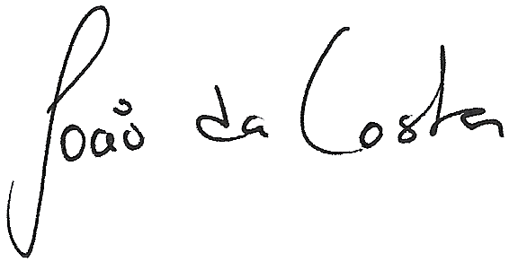

  

    
    <h3>Relatório Final</h3>

    Entidade: Citeforma
    Curso: Técnico Especialista em Cibersegurança
  
    Autor: João Rodrigo Mota da Costa

    Data de criação: 13 de outubro de 2023
    Data de revisão: 17 de outubro de 2023

  

.

<h3>Índice</h3> 

- [Resumo](#resumo)
- [Abstract](#abstract)
  - [Português de Portugal](#português-de-portugal)
  - [American English](#american-english)
- [Glossário](#glossário)
- [Tecnologias envolvidas](#tecnologias-envolvidas)
  - [Sistemas operativos](#sistemas-operativos)
  - [Encriptação](#encriptação)
  - [Ferramentas de análise forense](#ferramentas-de-análise-forense)
  - [Ferramentas de análise/planeamento de redes](#ferramentas-de-análiseplaneamento-de-redes)
  - [Ferramentas de defesa](#ferramentas-de-defesa)
  - [Ferramentas de *pentesting*](#ferramentas-de-pentesting)
  - [Linguagens de programação](#linguagens-de-programação)
  - [Máquinas Virtuais](#máquinas-virtuais)
  - [Scanners de vulnerabilidades](#scanners-de-vulnerabilidades)
  - [Software de comunicação](#software-de-comunicação)
  - [Software web e de servidor](#software-web-e-de-servidor)
- [Desenvolvimento do curso](#desenvolvimento-do-curso)
  - [Análise de evidências e vulnerabilidades](#análise-de-evidências-e-vulnerabilidades)
  - [Cibersegurança e ciberdefesa](#cibersegurança-e-ciberdefesa)
  - [Desenvolvimento profissional](#desenvolvimento-profissional)
  - [Formação geral](#formação-geral)
  - [Programação](#programação)
  - [Redes e telecomunicações](#redes-e-telecomunicações)
  - [Sistemas operativos](#sistemas-operativos-1)
- [Relação entre o curso e a formação em contexto de trabalho](#relação-entre-o-curso-e-a-formação-em-contexto-de-trabalho)
- [Conclusão](#conclusão)

## Resumo
No âmbito deste relatório, delineio a minha jornada ao longo do curso de Técnico Especialista em Cibersegurança no Citeforma, e do subsequente estágio, que decorreu na Wide Shift, uma MSP situada em São João da Talha, de maio a setembro de 2023. Irei proporcionar uma análise detalhada das minhas interações e experiências com os formadores, destacando as suas contribuições para o meu desenvolvimento profissional. Enfatizarei as tecnologias que integrei na minha formação e aplicação prática, elucidando a sua relevância no contexto da cibersegurança. Por último, examinarei a conexão essencial entre o curso e o estágio, destacando como a minha formação académica preparou-me para as demandas do mundo real e como a experiência de estágio enriqueceu o meu conhecimento e competências. Este relatório visa oferecer uma visão abrangente do meu percurso e demonstrar o meu crescimento como profissional na área da cibersegurança.

## Abstract
### Português de Portugal
Neste relatório, é apresentada uma análise detalhada do percurso académico e profissional do autor, abrangendo o curso de Técnico Especialista em Cibersegurança e um estágio de três meses e meio na Wide Shift, uma MSP (Managed Services Provider), realizado entre maio e setembro de 2023. O relatório destaca a interação do autor com os formadores, enfatiza as tecnologias fundamentais para a cibersegurança exploradas ao longo do percurso e examina a sinergia entre a formação académica e a experiência de estágio. Este relatório oferece uma visão abrangente da evolução do autor como profissional de cibersegurança, evidenciando o papel fundamental do ensino e da aplicação prática na preparação para desafios do mundo real.

### American English
This report provides a detailed analysis of the author's academic and professional journey, encompassing the Technical Specialist in Cybersecurity course and a three-and-a-half-month internship at Wide Shift, a Managed Services Provider (MSP), conducted between May and September of 2023. The report highlights the author's interactions with instructors, underscores the fundamental technologies explored in the field of cybersecurity, and examines the synergy between academic training and internship experience. This report offers a comprehensive view of the author's evolution as a cybersecurity professional, emphasizing the pivotal role of education and practical application in preparation for real-world challenges.

## Glossário
Este glossário destina-se a fornecer uma referência rápida e útil para os termos e conceitos essenciais utilizados ao longo deste relatório. A cibersegurança é um campo em constante evolução, repleto de terminologia técnica específica, e este recurso foi criado para auxilio na compreensão e interpretação do conteúdo apresentado.

| Termo | Significado em Inglês | Significado em Português | Definição |
|-|-|-|-|
| **MSP** | Managed Services Provider | Provedor de Serviços Geridos | Empresa que oferece serviços geridos de TI, como monitorização, manutenção e suporte para organizações. |
| **OWASP** | Open Web Application Security Project | Fundação de Segurança de Aplicativos Web Abertos | Comunidade de especialistas em segurança cibernética que fornece informações e recursos para ajudar a proteger aplicações web contra ameaças de segurança, como ataques cibernéticos. |
| **PBX** | Private Branch Exchange | Troca Automatizada de Ramais | Sistema de telecomunicações que permite às organizações encaminhar chamadas telefónicas internas e externas para os ramais dos funcionários numa rede telefónica privada. |
| **SIEM** | Security Information and Event Management | Gestão e Correlação de Eventos de Segurança | Sistema que recolhe, correlaciona e analisa eventos de segurança numa rede, permitindo que as organizações detetem e respondam a possíveis ameaças de segurança. |

## Tecnologias envolvidas
Ao longo do meu percurso no curso de Técnico Especialista em Cibersegurança e no estágio subsequente, deparei-me com um vasto leque de tecnologias essenciais para o campo da cibersegurança. Estas ferramentas desempenharam um papel fundamental na minha formação e experiência prática, permitindo-me desenvolver as competências necessárias para enfrentar os desafios do mundo da segurança cibernética. Nesta secção, destacarei as tecnologias que explorei e utilizei ao longo destas duas etapas da minha jornada académica e profissional.

### Sistemas operativos
- Arch Linux
- Debian
- Fedora
- Kali Linux
- Linux Mint
- OPNsense
- Parrot OS
- pfSense
- Red Hat Enterprise Linux 7/9
- Rocky Linux
- Ubuntu Desktop 22.10
- Ubuntu Server 22.04
- Windows 10/11
- Windows Server 2022

### Encriptação
- AES
- OpenPGP
- RSA
- Xiao Steganography

### Ferramentas de análise forense
- Autopsy
- FTK Imager

### Ferramentas de análise/planeamento de redes
- Cisco Packet Tracer
- Nmap
- Wireshark

### Ferramentas de defesa
- OpenCanary
- Snort
- Wazuh

### Ferramentas de *pentesting*
- Aircrack-ng
- Burp Suite
- Ettercap
- GoPhish
- Maltego
- Wifite

### Linguagens de programação
- Bash
- Batch
- C++
- CSS
- G-BASIC
- HTML
- Markdown
- Powershell
- Python
- SQL

### Máquinas Virtuais
- Hyper-V
- QEMU / KVM
- VirtualBox
- VMware ESXi
- VMware Workstation

### Scanners de vulnerabilidades
- OpenVAS
- Tenable Nessus

### Software de comunicação
- 3CX
- Zoiper

### Software web e de servidor
- Apache
- Asterisk
- Bind9
- NGINX
- Openfire
- OpenSSH
- PostFix
- Squid Proxy

## Desenvolvimento do curso
### Análise de evidências e vulnerabilidades
**Formador:** Rogélio Rodrigues

**UFCDs lecionadas:**
- UFCD 9189 | Tecnologias de analise de evidências
- UFCD 9191 | Introdução às Técnicas de Análise de Evidências
- UFCD 9192 | Análise de vulnerabilidades - iniciação
- UFCD 9193 | Análise de vulnerabilidades - desenvolvimento

**Temas abordados:**
- Aplicação de scans de vulnerabilidades
- Configuração e gestão de router e firewalls pfSense
- Configuração e gestão de servidores Windows e Linux
- Configuração e utilização de sistemas PBX
- Configuração e utilização de sistemas SIEM
- Exploração de vulnerabilidades inventariadas pelo OWASP

### Cibersegurança e ciberdefesa
**Formadores:** João Almeida, Luís Roque, Paulo Vaz, Ricardo Lobo

**UFCDs lecionadas:**
- UFCD 9188 | Fundamentos de cibersegurança
- UFCD 9194 | Introdução à cibersegurança e à ciberdefesa
- UFCD 9195 | Enquadramento operacional de cibersegurança
- UFCD 9196 | Cibersegurança Ativa
- UFCD 9197 | Wargaming

**Temas abordados:**
- Diferentes tipos de ataques cibernéticos
- Perfil e motivação de ataques cibernéticos
- Prática de análise forense

### Desenvolvimento profissional
**Formador:** João Delgado

**UFCDs lecionadas:**
- UFCD 0683 | Ética e deontologia profissionais
- UFCD 5065 | Empresa - estrutura e funções
- UFCD 9187 | Legislação, segurança e privacidade

**Temas abordados:**

### Formação geral
**Formadores:** José Luís Louro, Manuela Laranjeira

**UFCDs lecionadas:**
- UFCD 3769 | Probabilidades e estatística
- UFCD 5064 | Matemática
- UFCD 5745 | Inglês Técnico

**Temas abordados:**

### Programação
**Formadores:** Luís Roque, Maria João Duarte

**UFCDs lecionadas:**
- UFCD 5089 | Programação - Algoritmos
- UFCD 5117 | Primeiros conceitos de programação e algoritmia
- UFCD 5410 | Bases de dados - conceitos
- UFCD 9190 | Introdução à programação aplicada à cibersegurança

**Temas abordados:**

### Redes e telecomunicações
**Formadores:** João Pina, Manuel Ramos

**UFCDs lecionadas:**
- UFCD 5101 | Hardware e redes de computadores
- UFCD 5102 | Redes de computadores (avançado)
- UFCD 5104 | Instalação de redes locais
- UFCD 5106 | Serviços de rede
- UFCD 5892 | Modelos de gestão de redes e de suporte a clientes

**Temas aborbados:** 

### Sistemas operativos
**Formador:** António Matias

**UFCDs lecionadas:**
- UFCD 5113 | Sistema operativo cliente (plataforma proprietária)
- UFCD 5114 | Sistema operativo servidor (plataforma proprietária)

**Temas abordados:**

## Relação entre o curso e a formação em contexto de trabalho

## Conclusão

  

    
    

      © João Rodrigo Mota da Costa | 17 de outubro de 2023
    

  

