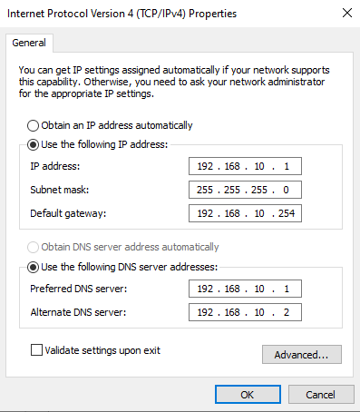
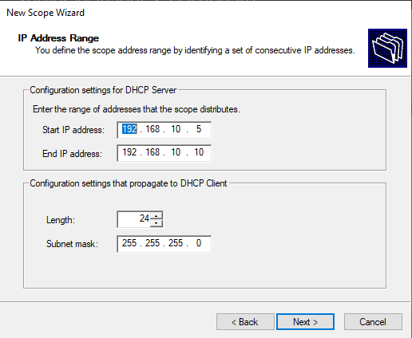
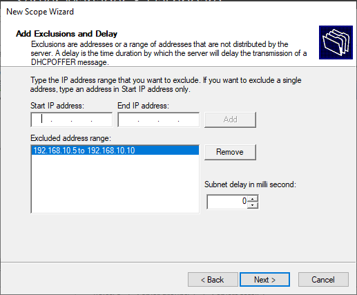
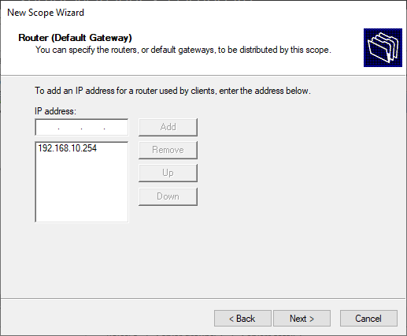
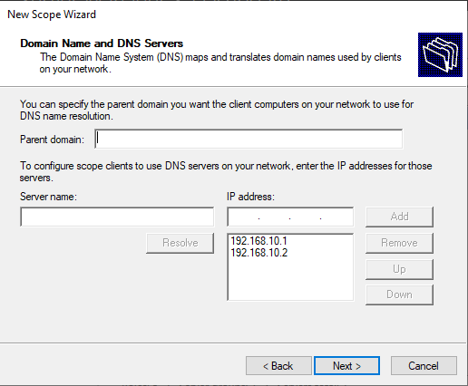

<h3>

**NOTA - ISTO FICOU IMCOMPLETO.**

</h>

# Guia de instalação de Virtual Machines

## Antes de começar
- Fazer download de todos os ISO's
- Ter o VMware/VirtualBox instalado e pronto a arrancar

## Configurações necessárias
    Domínio: ciseg.pt
    PfSense: 192.168.10.254
    Windows Server: 192.168.10.1 (scope reservada 5-10)
    Ubuntu Server: 192.168.10.2 (scope reservada 5-10)

## [PfSense](https://www.pfsense.org/download/)
### Configuração da máquina
    Tipo de Sistema Operativo: FreeBSD (64-bit)
    RAM: 1GB (1024MB)
    CPU: 1 thread
    Storage: Default (16GB)
    Network: 1 NAT, 1 LAN Segment / Internal Network (ciseg)
### Instalação
- (Next, next, next)
- Opção Auto UFS (BIOS)
- No > Reboot
- (Retirar disco após instalação)
### Configuração de Endereço IP
    2 > 2 > 192.168.10.254 > 24 > [ENTER] > [ENTER] > n > y

## [Windows Server (Parte 1)](https://www.microsoft.com/en-us/evalcenter/download-windows-server-2022)
### Configuração da máquina
    Tipo de Sistema Operativo: Windows Server 2022
    RAM: 4GB (4096)
    CPU: 1 core / 2 threads
    Storage: Default (50GB)
    Network: LAN Segment / Internal Network (ciseg)
### Instalação
- (Next, next, next)
- Windows Server 2022 Standard Evaluation (Desktop Experience)
### Configuração Local Server
- Computer Name > `WINSERVER`
- Ethernet > Desativar `TCP/IPv6` > Propriedades `TCP/IPv4`

    

- Time Zone > Change Time Zone > UTC
- (Reboot)

### Configuração roles e features
- (Next, next, next)
- Active Directory Domain Services (AD DS) / DHCP / DNS / IIS
- (Next, next, next)
- Configuration > Install
- (Reboot)

### Configuração DCHP
- Tools > DCHP
- winserver > Right-click IPv4 > New Scope...

    

### Promoção para Domain Controller
- Carregar na flag (Alertas)
- "Promote to Domain Controller"
- New forest > ciseg.pt
- Adicionar password no passo seguinte
- (Next, next, next)
- Install

### Group Policy Management

Mulheres:
    
    allow installing programs, but only with admin priv
    block calc
    block cmd
    block control
    block mspaint
    block taskbar
    block taskmgr
    block usb (w/message)
    disable camera
    disallow access to network settings
    disallow installing updates
    remove "run" from start
    remove log off option
    

Homens:

    hide drive
    start a script upon logon

Ambos:

    ask for password after sleep
    change wallpaper (something related to hacking)
    disable store apps (appx)
    disallow changing password
    disallow saving passwords/credentials
    remove all icons from desktop
    show title + message on login
    start a program on login