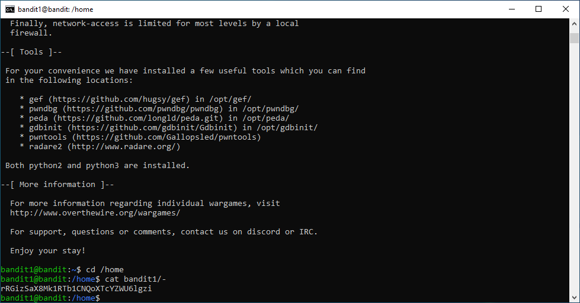
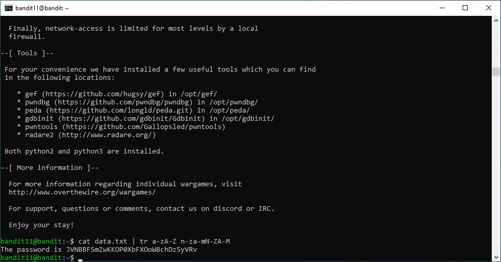

# 
Capture the Flag | Bandit
**
Citeforma | CET 8493 | UFCD 9197 Wargaming | Formador: Ricardo Lobo**
**
João Rodrigo Mota da Costa**
### Bandit0
	C:\Users\->ssh bandit0@bandit.labs.overthewire.org -p 2220

### Bandit0 > Bandit1
	bandit0@bandit:~$ cat readme

### Bandit1 > Bandit2
	bandit1@bandit:~$ cd /home
	bandit1@bandit:/home$ cat bandit1/-

### Bandit2 > Bandit3
	bandit2@bandit:~$ cd /home
	bandit2@bandit:/home$ cat 'bandit2/spaces in this filename'

### Bandit3 > Bandit4
	bandit3@bandit:~$ cat inhere/.hidden

### Bandit4 > Bandit5
	bandit4@bandit:~$ cd inhere/
	bandit4@bandit:~/inhere$ find -type f | xargs file && cat ./-file07

### Bandit5 > Bandit6
	bandit5@bandit:~$ find ./inhere -type f \! -executable -size 1033c
	bandit5@bandit:~$ cat ./inhere/maybehere07/.file2

### Bandit6 > Bandit7
	bandit6@bandit:~$ cd /
	bandit6@bandit:/$ find -type f -group bandit6 -user bandit7 | grep bandit7.password
	bandit6@bandit:/$ cat ./var/lib/dpkg/info/bandit7.password

### Bandit7 > Bandit8
	bandit7@bandit:~$ cat data.txt | grep millionth

### Bandit8 > Bandit9
	bandit8@bandit:~$ sort data.txt | uniq -c | grep "1 "

### Bandit9 > Bandit10
	bandit9@bandit:~$ strings data.txt | grep ===

### Bandit10 > Bandit11
	bandit10@bandit:~$ base64 -d data.txt

### Bandit11 > Bandit12
	bandit11@bandit:~$ cat data.txt | tr a-zA-Z n-za-mN-ZA-M

### Bandit12
