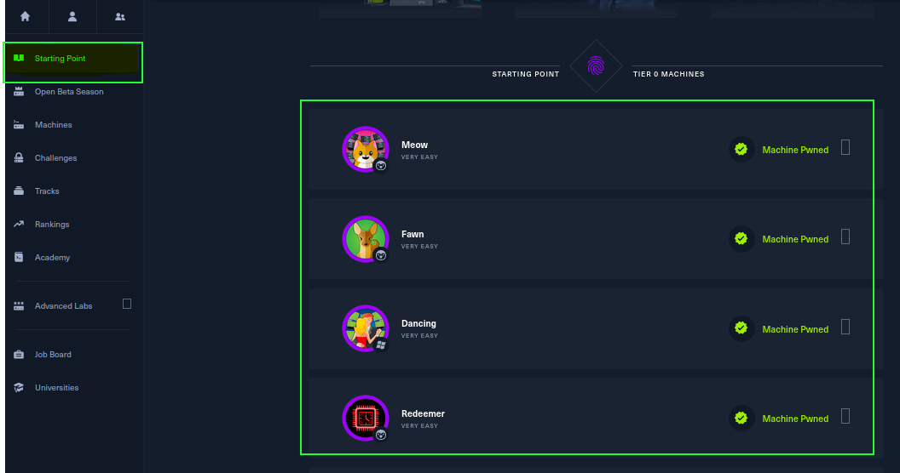
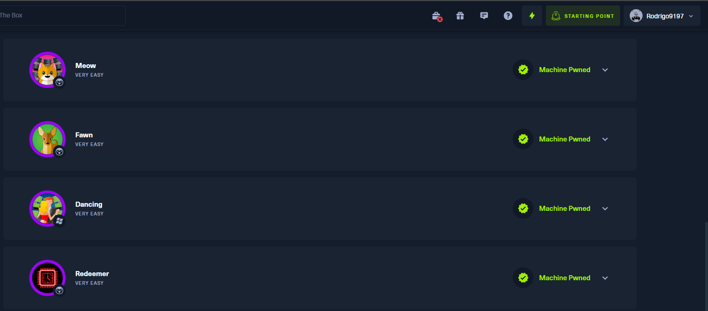

<h3>

**NOTA - ISTO FOI CONVERTIDO DE UM FICHEIRO DOCX PARA MARKDOWN. CASO HAJA ALGUM BUG OU INFORMAÇÃO ERRADA, POR FAVOR CRIAR UM ISSUE E EU RESOLVO ASAP**

</h>

<table style="width:100%;">
<colgroup>
<col style="width: 15%" />
<col style="width: 50%" />
<col style="width: 16%" />
<col style="width: 17%" />
</colgroup>
<thead>
<tr class="header">
<th><strong>MODALIDADE:</strong></th>
<th>Curso de Especialização Tecnológica (CET)</th>
<th colspan="2"><strong>Ficha 11: HackTheBox (CTF)</strong></th>
</tr>
</thead>
<tbody>
<tr class="odd">
<td><strong>CURSO:</strong></td>
<td colspan="3">Técnico especialista em cibersegurança</td>
</tr>
<tr class="even">
<td><strong>UFCD:</strong></td>
<td>Wargamming</td>
<td><strong>CÓDIGO UFCD:</strong></td>
<td>9197</td>
</tr>
<tr class="odd">
<td><strong>FORMADOR/A:</strong></td>
<td>Ricardo Lobo</td>
<td><strong>DATA:</strong></td>
<td>09/05/2023</td>
</tr>
<tr class="even">
<td></td>
<td></td>
<td></td>
<td></td>
</tr>
<tr class="odd">
<td colspan="4"><strong>OBJETIVOS</strong></td>
</tr>
<tr class="even">
<td colspan="4"><ul>
<li>
Introdução ao portal <em>HackTheBox</em>.
</li>
<li>
Completar todas as tarefas associadas ao “TIER 0” da categoria
“<em>Starting Point</em>”.
</li>
</ul></td>
</tr>
</tbody>
</table>

# Hack The Box

"*Hack the Box*" é uma plataforma de treino de *hacking* ético, que
permite aos seus utilizadores desenvolver as suas habilidades de
segurança informática num ambiente seguro e controlado.

A plataforma é composta por um conjunto de máquinas virtuais com
vulnerabilidades propositadamente criadas, que os utilizadores tentam
explorar e comprometer, com o objetivo de aprender técnicas de
exploração e defesa.

Os utilizadores podem aceder à plataforma através de um plano gratuito
ou através de subscrições pagas.

A plataforma também inclui um fórum onde os utilizadores podem partilhar
informações e discutir técnicas de *hacking*. "Hack the Box" é popular
entre os estudantes, os profissionais de segurança informática e
entusiastas de *hacking* ético, pois permite a prática de habilidades de
*hacking* num ambiente seguro e controlado.

# Atividades a realizar

1 – Aceda ao seguinte endereço e efetue o registo na plataforma.

- [https://app.hackthebox.com](https://app.hackthebox.com/)

2 – Explore as funcionalidades do site.

3 – Leia o conteúdo do ficheiro “***HackTheBox - Walkthrough***”,
disponível no Moodle.

4 – Aceda à categoria “***Starting Point***” e <u>realize todas as
tarefas</u> associadas às máquinas assinaladas abaixo:

5 – Registe todas as *flags* associadas às máquinas virtuais.

| **Nome da VM** | **Meow**                             |
|----------------|--------------------------------------|
| **Flag**       | **b40abdfe23665f766f9c61ecba8a4c19** |

| **Nome da VM** | **Fawn**                             |
|----------------|--------------------------------------|
| **Flag**       | **035db21c881520061c53e0536e44f815** |

| **Nome da VM** | **Dancing**                          |
|----------------|--------------------------------------|
| **Flag**       | **5f61c10dffbc77a704d76016a22f1664** |

| **Nome da VM** | **Redeemer**                         |
|----------------|--------------------------------------|
| **Flag**       | **03e1d2b376c37ab3f5319922053953eb** |

6 – Efetue o registo de um *print screen* onde comprove a conclusão de
todas as tarefas relacionadas com as 4 máquinas virtuais anteriores.

|  |
|-------------------------------------------------------------------------|

Depois de realizada a ficha de trabalho, submeta este ficheiro na tarefa
criada para o efeito.

**Bom trabalho**
