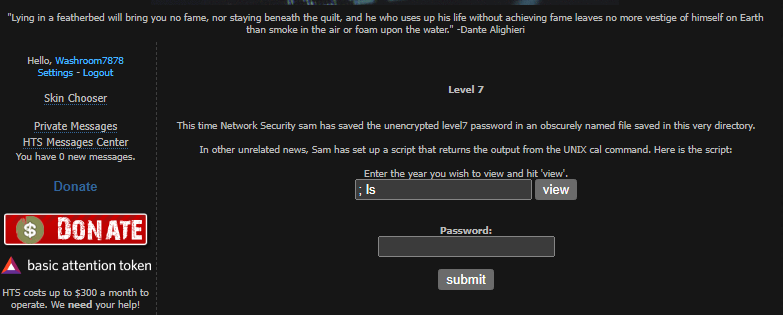
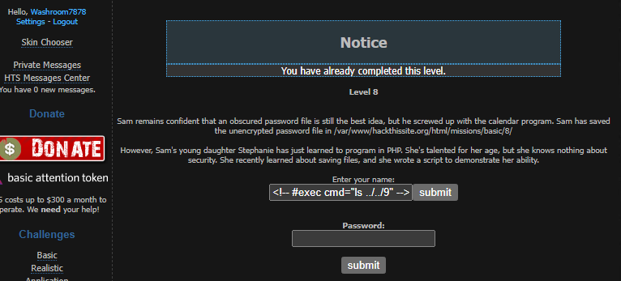

<h3>

**NOTA - ISTO FOI CONVERTIDO DE UM FICHEIRO DOCX PARA MARKDOWN. CASO HAJA ALGUM BUG OU INFORMAÇÃO ERRADA, POR FAVOR CRIAR UM ISSUE E EU RESOLVO ASAP**

</h>

<table style="width:100%;">
<colgroup>
<col style="width: 15%" />
<col style="width: 50%" />
<col style="width: 16%" />
<col style="width: 17%" />
</colgroup>
<thead>
<tr class="header">
<th><strong>MODALIDADE:</strong></th>
<th>Curso de Especialização Tecnológica (CET)</th>
<th colspan="2"><strong>Ficha 8: CTF – Hack This Site</strong></th>
</tr>
</thead>
<tbody>
<tr class="odd">
<td><strong>CURSO:</strong></td>
<td colspan="3">Técnico especialista em cibersegurança</td>
</tr>
<tr class="even">
<td><strong>UFCD:</strong></td>
<td>Wargamming</td>
<td><strong>CÓDIGO UFCD:</strong></td>
<td>9197</td>
</tr>
<tr class="odd">
<td><strong>FORMADOR/A:</strong></td>
<td>Ricardo Lobo</td>
<td><strong>DATA:</strong></td>
<td>21/04/2023</td>
</tr>
<tr class="even">
<td></td>
<td></td>
<td></td>
<td></td>
</tr>
<tr class="odd">
<td colspan="4"><strong>OBJETIVOS</strong></td>
</tr>
<tr class="even">
<td colspan="4"><ul>
<li>
Realização de vários desafios para captura da
“<em>flag</em>”.
</li>
</ul></td>
</tr>
</tbody>
</table>

Nesta ficha de trabalho, pretende-se que os formandos continuem a
realizar exercícios de *Capture The Flag*, para terem contacto com
diversos tipos de desafios e técnicas.

Todas as *flags* e resultados obtidos nesta ficha de trabalho, devem ser
registados nas respetivas áreas nesta ficha de trabalho.

## 

<table>
<colgroup>
<col style="width: 100%" />
</colgroup>
<thead>
<tr class="header">
<th><strong>Nível 1</strong></th>
</tr>
</thead>
<tbody>
<tr class="odd">
<td><h2 id="url-httpswww.hackthissite.orgmissionsbasic1">URL: <a
href="https://www.hackthissite.org/missions/basic/1/"><strong>https://www.hackthissite.org/missions/basic/1/</strong></a></h2>

“<em>This level is what we call "The Idiot Test", if you can't
complete it, don't give up on learning all you can, but, don't go
begging to someone else for the answer, thats one way to get you
hated/made fun of. Enter the password and you can continue.</em>”

<strong>Help:</strong> 
If you have no idea what to do, you must <a
href="http://www.w3schools.com/HTML">learn HTML</a>.
</td>
</tr>
<tr class="even">
<td><strong>RESOLUÇÃO - <em>print screens</em> da
resolução</strong></td>
</tr>
<tr class="odd">
<td></td>
</tr>
<tr class="even">
<td><strong>FLAG</strong></td>
</tr>
<tr class="odd">
<td>b6622dca</td>
</tr>
</tbody>
</table>

<table>
<colgroup>
<col style="width: 100%" />
</colgroup>
<thead>
<tr class="header">
<th><strong>Nível 2</strong></th>
</tr>
</thead>
<tbody>
<tr class="odd">
<td><h2 id="url-httpswww.hackthissite.orgmissionsbasic2">URL: <a
href="https://www.hackthissite.org/missions/basic/2/"><strong>https://www.hackthissite.org/missions/basic/2/</strong></a></h2>

“<em>Network Security Sam set up a password protection script. He
made it load the real password from an unencrypted text file and compare
it to the password the user enters. However, he neglected to upload the
password file...</em>”
</td>
</tr>
<tr class="even">
<td><strong>RESOLUÇÃO - <em>print screens</em> da
resolução</strong></td>
</tr>
<tr class="odd">
<td></td>
</tr>
<tr class="even">
<td><strong>FLAG</strong></td>
</tr>
<tr class="odd">
<td></td>
</tr>
</tbody>
</table>

## 

<table>
<colgroup>
<col style="width: 100%" />
</colgroup>
<thead>
<tr class="header">
<th><strong>Nível 3</strong></th>
</tr>
</thead>
<tbody>
<tr class="odd">
<td><h2 id="url-httpswww.hackthissite.orgmissionsbasic3">URL: <a
href="https://www.hackthissite.org/missions/basic/3/"><strong>https://www.hackthissite.org/missions/basic/3/</strong></a></h2>

“<em>This time Network Security Sam remembered to upload the password
file, but there were deeper problems than that.</em>”
</td>
</tr>
<tr class="even">
<td><strong>RESOLUÇÃO - <em>print screens</em> da
resolução</strong></td>
</tr>
<tr class="odd">
<td></td>
</tr>
<tr class="even">
<td><strong>FLAG</strong></td>
</tr>
<tr class="odd">
<td>dd879e75</td>
</tr>
</tbody>
</table>

<table>
<colgroup>
<col style="width: 100%" />
</colgroup>
<thead>
<tr class="header">
<th><strong>Nível 4</strong></th>
</tr>
</thead>
<tbody>
<tr class="odd">
<td><h2 id="url-httpswww.hackthissite.orgmissionsbasic4"><strong>URL: <a
href="https://www.hackthissite.org/missions/basic/4/">https://www.hackthissite.org/missions/basic/4/</a></strong></h2>

<em>“This time Sam hardcoded the password into the script. However,
the password is long and complex, and Sam is often forgetful. So he
wrote a script that would email his password to him automatically in
case he forgot. Here is the script:”</em>
</td>
</tr>
<tr class="even">
<td><strong>RESOLUÇÃO - <em>print screens</em> da
resolução</strong></td>
</tr>
<tr class="odd">
<td></td>
</tr>
<tr class="even">
<td><strong>FLAG</strong></td>
</tr>
<tr class="odd">
<td>29186542</td>
</tr>
</tbody>
</table>

<table>
<colgroup>
<col style="width: 100%" />
</colgroup>
<thead>
<tr class="header">
<th><strong>Nível 5</strong></th>
</tr>
</thead>
<tbody>
<tr class="odd">
<td><h2 id="url-httpswww.hackthissite.orgmissionsbasic5"><strong>URL: <a
href="https://www.hackthissite.org/missions/basic/5/">https://www.hackthissite.org/missions/basic/5/</a></strong></h2>

<em>“Sam has gotten wise to all the people who wrote their own forms
to get the password. Rather than actually learn the password, he decided
to make his email program a little more secure.”</em>
</td>
</tr>
<tr class="even">
<td><strong>RESOLUÇÃO - <em>print screens</em> da
resolução</strong></td>
</tr>
<tr class="odd">
<td></td>
</tr>
<tr class="even">
<td><strong>FLAG</strong></td>
</tr>
<tr class="odd">
<td>3678a323</td>
</tr>
</tbody>
</table>

<table>
<colgroup>
<col style="width: 100%" />
</colgroup>
<thead>
<tr class="header">
<th><strong>Nível 6</strong></th>
</tr>
</thead>
<tbody>
<tr class="odd">
<td><h2 id="url-httpswww.hackthissite.orgmissionsbasic6"><strong>URL: <a
href="https://www.hackthissite.org/missions/basic/6/">https://www.hackthissite.org/missions/basic/6/</a></strong></h2>

<em>"Any nominee for the position of attorney general who has to
defend himself from charges of supporting torture is already an unfit
candidate. Any senator voting for this man is unfit to represent his or
her constituents." --Wendy Miller, in a letter to the NY Times”</em>

Utilize o seguinte código para criar um <em>script</em> em Python,
que lhe irá permitir a obtenção da <em>flag</em> deste nível.

<blockquote>

</blockquote>

<strong>Nota:</strong> Terá de acrescentar algo no código para
conseguir obter a <em>flag</em>.
</td>
</tr>
<tr class="even">
<td><strong>RESOLUÇÃO - <em>print screens</em> da
resolução</strong></td>
</tr>
<tr class="odd">
<td></td>
</tr>
<tr class="even">
<td><strong>FLAG</strong></td>
</tr>
<tr class="odd">
<td>5c4f1336</td>
</tr>
</tbody>
</table>

<table>
<colgroup>
<col style="width: 100%" />
</colgroup>
<thead>
<tr class="header">
<th><strong>Nível 7</strong></th>
</tr>
</thead>
<tbody>
<tr class="odd">
<td><h2 id="url-httpswww.hackthissite.orgmissionsbasic7"><strong>URL: <a
href="https://www.hackthissite.org/missions/basic/7/">https://www.hackthissite.org/missions/basic/7/</a></strong></h2>

<strong>Comando útil:</strong> <strong><mark>;
ls</mark></strong>
</td>
</tr>
<tr class="even">
<td><strong>RESOLUÇÃO - <em>print screens</em> da
resolução</strong></td>
</tr>
<tr class="odd">
<td></td>
</tr>
<tr class="even">
<td><strong>FLAG</strong></td>
</tr>
<tr class="odd">
<td>0a394e88</td>
</tr>
</tbody>
</table>

<table>
<colgroup>
<col style="width: 100%" />
</colgroup>
<thead>
<tr class="header">
<th><strong>Nível 8</strong></th>
</tr>
</thead>
<tbody>
<tr class="odd">
<td><h2 id="url-httpswww.hackthissite.orgmissionsbasic8"><strong>URL: <a
href="https://www.hackthissite.org/missions/basic/8/">https://www.hackthissite.org/missions/basic/8/</a></strong></h2>

<strong>Comando útil:</strong> <strong><mark>&lt;!-- #exec cmd="ls
../" --&gt;</mark></strong>
</td>
</tr>
<tr class="even">
<td><strong>RESOLUÇÃO - <em>print screens</em> da
resolução</strong></td>
</tr>
<tr class="odd">
<td></td>
</tr>
<tr class="even">
<td><strong>FLAG</strong></td>
</tr>
<tr class="odd">
<td>a2a51cff</td>
</tr>
</tbody>
</table>

<table>
<colgroup>
<col style="width: 100%" />
</colgroup>
<thead>
<tr class="header">
<th><strong>Nível 9</strong></th>
</tr>
</thead>
<tbody>
<tr class="odd">
<td><h2 id="url-httpswww.hackthissite.orgmissionsbasic9"><strong>URL: <a
href="https://www.hackthissite.org/missions/basic/9/">https://www.hackthissite.org/missions/basic/9/</a></strong></h2>

<strong>Comando útil:</strong> <strong><mark>&lt;!-- #exec cmd="ls
../../9" --&gt;</mark></strong>
</td>
</tr>
<tr class="even">
<td><strong>RESOLUÇÃO - <em>print screens</em> da
resolução</strong></td>
</tr>
<tr class="odd">
<td></td>
</tr>
<tr class="even">
<td><strong>FLAG</strong></td>
</tr>
<tr class="odd">
<td>64b1c867</td>
</tr>
</tbody>
</table>

<table>
<colgroup>
<col style="width: 100%" />
</colgroup>
<thead>
<tr class="header">
<th><strong>Nível 10</strong></th>
</tr>
</thead>
<tbody>
<tr class="odd">
<td><h2 id="url-httpswww.hackthissite.orgmissionsbasic10"><strong>URL:
<a
href="https://www.hackthissite.org/missions/basic/10/">https://www.hackthissite.org/missions/basic/10/</a></strong></h2>

<strong>Dica:</strong> Recorrendo às “<u>Ferramentas do
programador</u>” do seu <em>browser</em>, encontre uma <em>cookie</em>
com o nome “<strong>level10_authorized</strong>“. Verifique o valor
dessa cookie e tente alterar o seu valor.
</td>
</tr>
<tr class="even">
<td><strong>RESOLUÇÃO - <em>print screens</em> da
resolução</strong></td>
</tr>
<tr class="odd">
<td></td>
</tr>
<tr class="even">
<td><strong>FLAG</strong></td>
</tr>
<tr class="odd">
<td>N/A</td>
</tr>
</tbody>
</table>

<table>
<colgroup>
<col style="width: 100%" />
</colgroup>
<thead>
<tr class="header">
<th><strong>Nível 11</strong></th>
</tr>
</thead>
<tbody>
<tr class="odd">
<td><h2 id="url-httpswww.hackthissite.orgmissionsbasic11"><strong>URL:
<a
href="https://www.hackthissite.org/missions/basic/11/">https://www.hackthissite.org/missions/basic/11/</a></strong></h2>

<em>[?????]: I love my music! "<strong>Bite Your Lip (Get Up and
Dance!)</strong>" is the best!</em>

<ul>
<li>
<em>[?????] = Nome do autor.</em>
</li>
</ul>

Descubra o nome do autor e utilize a primeira letra do nome para
completar o endereço abaixo:

<blockquote>

<strong>https://www.hackthissite.org/missions/basic/11/?/</strong>

</blockquote>

Navegue na estrutura de pastas que lhe será apresentada, até não ter
mais ficheiros ou pastas disponíveis. Nessa pasta, tente aceder ao
conteúdo do ficheiro com o nome “<strong>.htaccess</strong>”.

O ficheiro “<strong>.htaccess</strong>” irá disponibilizar-lhe uma
informação muito importante para atingir o seu objetivo.
</td>
</tr>
<tr class="even">
<td><strong>RESOLUÇÃO - <em>print screens</em> da
resolução</strong></td>
</tr>
<tr class="odd">
<td></td>
</tr>
<tr class="even">
<td><strong>FLAG</strong></td>
</tr>
<tr class="odd">
<td>N/A</td>
</tr>
</tbody>
</table>

Submeta este ficheiro na tarefa criada para o efeito.

**Bom trabalho**
