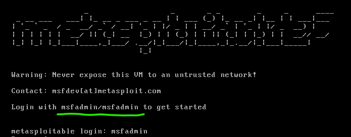

<h3>

**NOTA - ISTO FOI CONVERTIDO DE UM FICHEIRO DOCX PARA MARKDOWN. CASO HAJA ALGUM BUG OU INFORMAÇÃO ERRADA, POR FAVOR CRIAR UM ISSUE E EU RESOLVO ASAP**

</h>

<table>
<colgroup>
<col style="width: 15%" />
<col style="width: 50%" />
<col style="width: 16%" />
<col style="width: 17%" />
</colgroup>
<thead>
<tr class="header">
<th><strong>MODALIDADE:</strong></th>
<th>Curso de Especialização Tecnológica (CET)</th>
<th colspan="2"><strong>Ficha 9: Metasploit –
Metasploitable</strong></th>
</tr>
</thead>
<tbody>
<tr class="odd">
<td><strong>CURSO:</strong></td>
<td colspan="3">Técnico especialista em cibersegurança</td>
</tr>
<tr class="even">
<td><strong>UFCD:</strong></td>
<td>Wargamming</td>
<td><strong>CÓDIGO UFCD:</strong></td>
<td>9197</td>
</tr>
<tr class="odd">
<td><strong>FORMADOR/A:</strong></td>
<td>Ricardo Lobo</td>
<td><strong>DATA:</strong></td>
<td>28/04/2023</td>
</tr>
<tr class="even">
<td></td>
<td></td>
<td></td>
<td></td>
</tr>
<tr class="odd">
<td colspan="4"><strong>OBJETIVOS</strong></td>
</tr>
<tr class="even">
<td colspan="4"><ul>
<li>
Conhecer o Metasploitable 2.
</li>
<li>
Primeiro contacto com o Metasploit
</li>
</ul></td>
</tr>
</tbody>
</table>

# Metasploitable 2

O Metasploitable 2 é uma máquina virtual criada para ser usada como um
ambiente de teste para avaliação de segurança e aprendizagem de técnicas
de testes de penetração. Este sistema foi projetado para conter
múltiplas vulnerabilidades conhecidas e exploráveis, permitindo que os
*pentesters* pratiquem técnicas de exploração de vulnerabilidades num
ambiente controlado e seguro.

## Passo 1

Efetue o *download* do ficheiro “**Metasploitable.vmdk**” que se
encontra disponível para *download* na localização abaixo:

[https://wetransfer.com/downloads/dc624cdac826392712063428446fd8cd20230427232423/43181cb46725d86d003802ad98b7815d20230427232443/21ba89](https://wetransfer.com/downloads/dc624cdac826392712063428446fd8cd20230427232423/43181cb46725d86d003802ad98b7815d20230427232443/21ba89?trk=TRN_TDL_01&utm_campaign=TRN_TDL_01&utm_medium=email&utm_source=sendgrid)

## Passo 2

Crie uma máquina virtual no seu computador utilizando o ficheiro
“**Metasploitable.vmdk**” fornecido pelo formador.

> Vídeo: <https://www.youtube.com/watch?v=I6WfFLQwoPg&t=30s>

Requisitos da máquina virtual:

- <u>Memória RAM</u>: 512MB

- <u>Processadores</u>: 1

- <u>Adaptador de rede</u>: Rede LAB (apenas com comunicação com a VM do
  Kali Linux).

## Passo 3

Execute as VMs do Metasploitable e do Kali e faça testes de conetividade
entre as máquinas, para confirmar o correto funcionamento.

**Dados de acesso à VM do Metasploitable 2:**

- <u>Username</u>: **msfadmin**

- <u>Password</u>: **msfadmin**

## 

## Passo 4

No Kali Linux, abra o terminal e atualize a base de dados do seu
Metasploit, executando o comando abaixo.

| **Comando** |
|-------------|
| msfupdate   |

## Passo 5

Execute o Metasploit no Kali Linux, executando o comando abaixo.

| **Comando** |
|-------------|
| Msfconsole  |

## Passo 6

Recorrendo ao Metasploit, faça uma pesquisa das vulnerabilidades
presentes na VM do Metasploitable 2.

<table>
<colgroup>
<col style="width: 100%" />
</colgroup>
<thead>
<tr class="header">
<th><strong>Comando</strong></th>
</tr>
</thead>
<tbody>
<tr class="odd">
<td>db_nmap -v --script vuln [IP VM Metasploitable 2]</td>
</tr>
<tr class="even">
<td>
Exemplo:

</td>
</tr>
</tbody>
</table>

| **Registe com capturas de ecrã, os passos que efetuou e os resultados obtidos** |
|---------------------------------------------------------------------------------|
|         |
|         |

## Passo 7

Com base nos diapositivos disponibilizados pelo formador, efetue a
exploração da vulnerabilidade no serviço de FTP (**vsftpd**).

| **Registe com capturas de ecrã, os passos que efetuou e os resultados obtidos** |
|---------------------------------------------------------------------------------|
|  |
|  |

Depois de realizada a ficha de trabalho, submeta este ficheiro na tarefa
criada para o efeito.

**Bom trabalho**